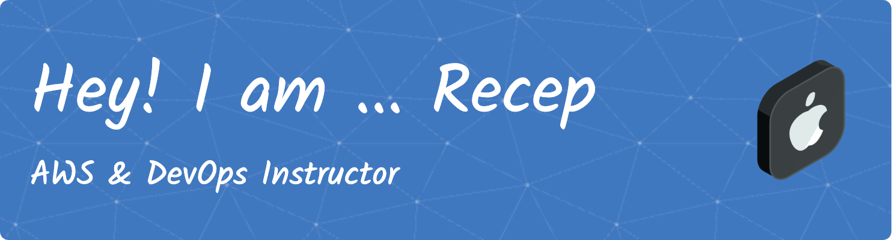

:mailbox: Reach me out!

- 🌱 I’m currently learning 

- 👨‍💻 All of my projects are available at 

- 💬 Ask me about **AWS,GCP,GitOps,k8s,Monitoring etc.**

<strong>💼 Certificates :</strong>

📃 K8S Certificates

<!--       -->

📃 AWS Certificates

📃 Hashicorp Certificates

<!--  -->

### Blogs posts
<!-- BLOG-POST-LIST:START -->
<!-- BLOG-POST-LIST:END -->

<!-- <h3 align="left">Connect with me:</h3>

 -->

<h3 align="left">Languages and Tools:</h3>

                          

<h3 align="left">Support:</h3>

  

&nbsp;

  
